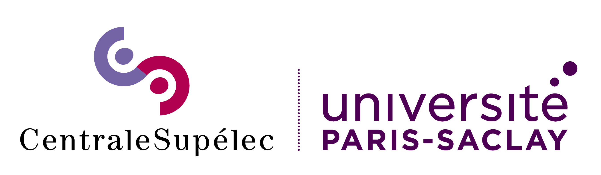
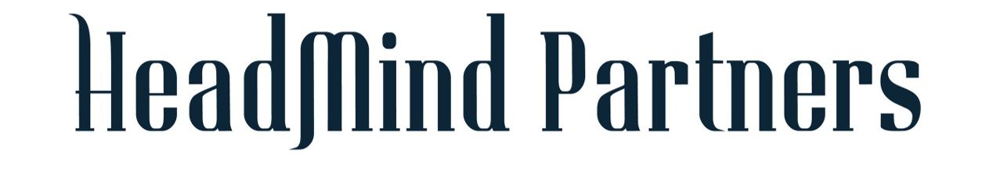
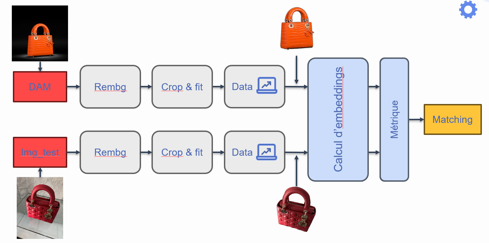

# ChallengeAI w/ HeadmindPartners
Ce dépôt contient notre travail pour le ChallengeIA, faisant partie de notre troisème année à CentraleSupélec en mention IA

Ce challenge est réalisé en partenariat avec Hedmind Partners

## Consignes
#### Données :

Le dataset Dior est composé de deux dossiers et d'un fichier csv : 

data/ 
│ 
├── DAM/ 
│   ├── 01BB01A2102X4847.jpeg 
│   ├── ... 
│
├── test_image_headmind/ 
│   ├── image-20210928-102713-12d2869d.jpeg 
│   ├── ... 
│ 
└── product_list.csv 

- Le dossier "DAM" contient tous les jpeg de références de chaque article (2 766 articles). Le nom de chaque jpeg correspond à son MMC référencé dans le csv. Chaque image est de taille 256x256.

- Le deuxième dossier "test_image_headmind" contient les images test (80 images test). Tous les articles compris dans ces images sont référencés dans DAM et le fichier csv. La taille de ces images est variable. Les images ne sont pas annotées. Le nom du fichier correspond à la nomenclature donnée par l'appareil photo.

- Le fichier csv "product_list" comprend le code MMC unique à chaque article ainsi que le Product_BusinessUnitDesc précisant la classe de l'article (Bags, Shoes, etc)
 
 
#### Objectif :

Le but du projet est de retrouver la référence d'un article à partir d'une photo de ce dernier. Il faut donc utiliser les caractéristiques visuelles des objets afin de retrouver l'article.
 
*Exemple* : Par exemple à partir de l'image `./test_image_headmind/IMG_6880.jpg` , le modèle doit renvoyer l'image `./DAM/BOBYR1UXR42FR.jpeg`.

## Méthode

Ce challenge nous a permis de mettre en oeuvre une pipeline permettant de retrouver des références d'articles de luxe pris en photo en utilisant exclusivement l'image comme support de données.

Les méthodes employées dans ce projet sont les suivantes :

- Traitement d'images et mise en forme de données (suppression arrière-plan, crop, resize)
- Data augmentation (flip, rotation, couleur)
- Transfer learning, basé sur ResNet-50, DINOV2, Clip, ...
- Fine tuning
- Benchmark des pipelines

#### Résultats
Le modèle le plus performant est ResNet-50, exploitant la data augmentation au moyen de flip horizontaux, utilisant la métrique cosine. 
L'évaluation du modèle est basée sur l'accuracy, élargie aux top 3 et top 5 : une prédictuion est comptée juste lorsque la référence exacte du produit attendue est proposée par le modèle dans son top 3 (respectivement top 5)

| Accuracy top 1 | Accuracy top 3 | Accuracy top 5 |
|----------------|---|---|
| 45%              | 60% | 69% |

Nous avons orienté la conception de notre solution avec une vision produit, gardé en tête l'utilité finale que peut avoir le client du produit qui est développé. Ce produit peut typiquement tre intégré à une applicaition mobile pour que le client ait la référence exacte du produit scanné en magasin grâce à son téléphone, ou bien pour que le vendeur puisse réaliser son inventaire de stock en scannant les articles de la boutique.

#### Présentation
La présentation utilisée pour notre soutenance peut être retrouvée [ici](/param/Soutenance_HeadMindPartners.pdf)

 
